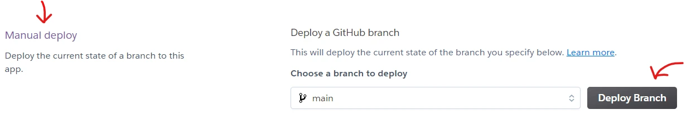

# **CONNECT 4**

Connect Four (also known as Connect 4, Four Up, Plot Four, Find Four, Captain's Mistress, Four in a Row, Drop Four, and Gravitrips in the Soviet Union) is a popular two-player connection board game, in which the players choose a color and then take turns dropping colored tokens into a seven-column, six-row vertically suspended grid. The pieces fall straight down, occupying the lowest available space within the column. The objective of the game is to be the first to form a horizontal, vertical, or diagonal line of four of one's own tokens.

For my project I made a simplified version where the the winner is the first one to have 4 in a **horizontal row**.

## How to play

In this command-line version of Connect 4, the user plays against the computer and the tokens are replaced by letters: 'R' as red and 'Y' as yellow.
User is player 1 (R) and computer is player 2 (Y).

User is prompted to choose a column number for dropping his/her letter and the computer randomly provides a column number for dropping its.
The game should run until someone makes 4 in a row.

You can visit the deployed application following this link: [sbo-connect4](https://sbo-connect4.herokuapp.com/)

## Features
### Existing features
- Instructions for playing and a sample of the grid are presented to the user right at the beginning:

- The game has been set to play user vs. computer. Computer randomly provides integers from 0-6 as its choice of a column.

- Every time the user is prompted to give input, there is a try-except check to validate that the input is correct.
    The first invitation for input is asking the user for his/her name.
    As long as the name is an empty string, the question "Hi, what's your name?" will coming back.
    Having provided a name, the user is then welcomed and roles are distributed and explained: user is player 1 and plays 'R'; computer is player 2 and plays 'Y'.

- The second and last invitation for input is asking the user his/her choice of column.
Only integers from 0-6 are accepted as valid input. If validation fails, the user is informed that the input is invalid and is invited again to provide a column number:

### Future features

- Adding the functionality to win with 4 in vertical or diagonal row as in the classic game.
- Adding extra levels of difficulty by playing on a bigger grid.

## Data Model

The project was built using a functional style.

All the structure of the game and its logic have been bind in, as much as possible, atomic functions
(each  function performing only one task).
The name of the functions have been set with the intention of describing the function's purpose and the added
docstring reinforces it.

## Testing

The code has passed the test on the [CI Python Linter](https://pep8ci.herokuapp.com/) and I can confirm there isn't any problem: 

Some warnings and infos. remain as shown below:

None action was taken on those because:
- player and computer variables aren't constants. They were set as global variables because accesing them as required for different functions to properly work;
- snake_case naming style doesn't apply in the case of the variable 'e' (as error in Python).

### Testing the code

Regarding the user's input (name and choice of column), I tried using wrong values to check that the exceptions worked as expected and that once the input is valid the game goes on.
Images of these are available above on the features section.

## Bugs

### Fixed bugs
Display_choice_computer was not getting update after the first run.
I fixed this by adding computer = random.randit(0, 6) at the botton of the function.
My purpose being to "re roll the dice".

## Deployment

Before hand, the required dependencies were added to the requirements.txt file on the GitPod template.

Afterwards the application was successfully deployed on Heroku.

These are the steps followed for completing the deployment:

1. On Heroku, from the Dashboard create a new app.
2. On the newly created app click on 'Settings':

3. Scroll down to 'Buildpack' section and clic on 'Add buildpack';
4. In this order add, Python and Nodejs buildpacks. The result should look like this:

5. Scroll up to 'Config Vars' section and clic on 'Reveal Config Vars';
6. Add 'Port' on the 'KEY' field and '8000' on the 'VALUE' one. Next clic on 'Add':

7. Go up and click on 'Deploy':

8. From the 'Deployment method' section, clic on 'GitHub connect'. The repository is now connected from GitHub to Heroku;

9. Finally scroll down to 'Manual deploy' and clic on 'Deploy Branch':

 Heroku will make the necessary and a button 'View' will redirect you to the deployed application.

 

## Credits

[Wikipedia](https://en.wikipedia.org/wiki/Connect_Four) for the explanatory text about the Connect 4 game.

The check_horizontal_win function was inspired by the last comment on this article on Slack:
https://stackoverflow.com/questions/71003762/checking-if-list-contains-same-element-in-straight-row

My mentor helped me to tune the code for that function.

## Acknowledgments

As usual, thanks a million to my patient and loving family.

To my awesome mentor, Daisy McGuirr, for her guidance and support.

Warm thanks to the CI community on Slack who remains a source to turn to when searching for quick answers.

